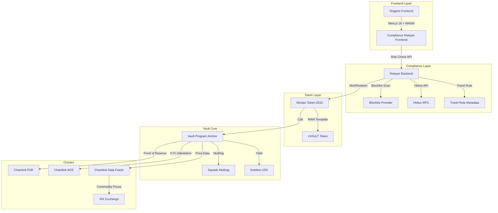

# Oragami (CommoVault) - Technical Specification

## Project Overview

**Project Name**: Oragami (formerly CommoVault)  
**Hackathon Track**: RWA-Backed Stablecoin & Commodity Vaults (Track 4)  
**Deadline**: March 29, 2026

### Core Concept
A fully compliant, institutional-grade vault that lets regulated entities deposit assets → mint a backed vault token (cVAULT) → automatically allocate into Solstice USX for delta-neutral yield, while the underlying basket (Ondo-style tokenized Treasuries + SIX-priced commodities) is verified in real time by Chainlink Proof of Reserve + ACE.

### Key Constraint
No secondary-market tradeability. All operations are permissioned mint/redeem flows controlled via Squads multisig + compliance checks.

---

## Architecture Overview



---

## Token Design

### cVAULT Token
- **Purpose**: Vault share token (1:1 backed by RWA basket)
- **Type**: Token-2022 (Mosaic RWA template)
- **Extensions**:
  - Metadata (SIX commodity pricing display)
  - Permanent Delegate (vault can burn for redemption)
  - Pausable (emergency stop)
  - Default Account State (sRFC-37 allowlist - only compliant wallets)
- **Authority**: Squads multisig + vault PDA

### Underlying Basket (Mock for MVP)
- Tokenized Treasuries (Ondo-style)
- SIX-priced commodities (Gold, Silver, Oil, etc.)

---

## Compliance Flow

Every operation follows this exact sequence:

1. **User connects wallet** in frontend
2. **Risk Check API** → backend runs:
   - Blocklist scan
   - Range Protocol check
   - Helius address analysis
3. **WASM Signing** → User signs `{from}:{to}:{amount}:{mint}:{nonce}` client-side
4. **ACE Attestation** → Mock oracle returns KYC/KYT/AML/Travel Rule compliance
5. **Vault Operation** → Only then does the vault program mint/redeem

---

## Core Flows

### 1. Deposit & Mint
```
User deposits USDC/SOL
    → Compliance Check (risk-scan + WASM sign + ACE)
    → Mosaic issues cVAULT (Token-2022)
    → Vault swaps portion → Solstice USX
    → Chainlink PoR updates
```

### 2. Yield Accrual
```
Auto-call Solstice YieldVault
    → Claim USX yield
    → Reinvest or distribute
```

### 3. Redeem
```
User submits redemption request
    → Compliance Check
    → Burn cVAULT (permanent delegate)
    → Return USX + pro-rata RWA basket
    → Prices from Chainlink + SIX mock
```

---

## Reference Repositories

| Repo | Purpose | Integration |
|------|---------|-------------|
| [solana-foundation/mosaic](https://github.com/solana-foundation/mosaic) | Token-2022 issuance (RWA template + sRFC-37) | Fork and use RWA template for cVAULT |
| [Berektassuly/solana-compliance-relayer-frontend](https://github.com/Berektassuly/solana-compliance-relayer-frontend) | Compliance UI + WASM signer + relayer backend | Fork and extend with Origami Vault tab |

---

## Implementation Plan

### Phase 1: Fork & Setup (Day 0)
1. Fork both repositories to team GitHub
2. Clone into project workspace
3. Run `pnpm install && pnpm build` for Mosaic
4. Run `pnpm install && wasm-pack build` for compliance relayer
5. Create new Anchor project for vault program

### Phase 2: Token + Vault Core (Day 1)
1. Configure Mosaic SDK to mint cVAULT with permanent delegate
2. Implement deposit/mint/redeem Anchor instructions
3. Set up vault PDA with Squads multisig

### Phase 3: Compliance Integration (Day 2)
1. Add "Origami Vault" tab to relayer frontend
2. Wire buttons to risk-check + WASM sign + ACE mock
3. Add `/vault-operation` endpoint in backend

### Phase 4: Yield + Oracles (Day 3)
1. Add Chainlink oracle calls
2. Mock SIX price feed
3. Solstice USX swap integration
4. Build Proof of Reserve dashboard

### Phase 5: Demo & Polish (Day 4)
1. Record technical walkthrough video
2. Record pitch video
3. Finalize README

---

## Tech Stack

| Layer | Technology |
|-------|------------|
| Token Issuance | Mosaic SDK (Token-2022 RWA template) |
| Compliance UI | Next.js 16 + Tailwind + Zustand |
| Compliance Backend | Rust/Axum + WASM |
| Vault Logic | Anchor (Solana) |
| Oracles | Chainlink Data Feeds + PoR + ACE |
| Yield | Solstice USX |
| Multisig | Squads |
| Data | SIX (mock for demo) |

---

## Demo Script (2 min)

1. **Introduction** - Show Oragami dashboard
2. **Deposit Flow** - Connect wallet → Deposit USDC → Compliance scan → Mint cVAULT
3. **Yield View** - Show USX allocation + Chainlink PoR
4. **Redeem Flow** - Submit redemption → Compliance check → Receive assets
5. **Compliance Demo** - Show blocked transaction (non-compliant wallet)

---

## Submission Requirements

- [ ] Public GitHub (forks + new vault program)
- [ ] Testnet demo link
- [ ] 2-min technical video
- [ ] 2-3 min pitch video
- [ ] Team + project names

---

## Why This Wins

| Criteria | How We Meet It |
|----------|----------------|
| Team Execution & Technical Readiness | Forking official Solana Foundation + real compliance relayer |
| Institutional Fit & Compliance | Every flow uses risk scanner + WASM signing + ACE |
| Innovativeness | First hackathon combining Mosaic + relayer + Solstice USX + SIX |
| Scalability & Adoption | Ready for AMINA Bank pilot - permissioned, auditable |

---

## Next Steps

1. Approve this specification
2. Switch to Code mode to fork repositories and begin implementation
3. Create Anchor vault program skeleton
4. Configure Mosaic token creation