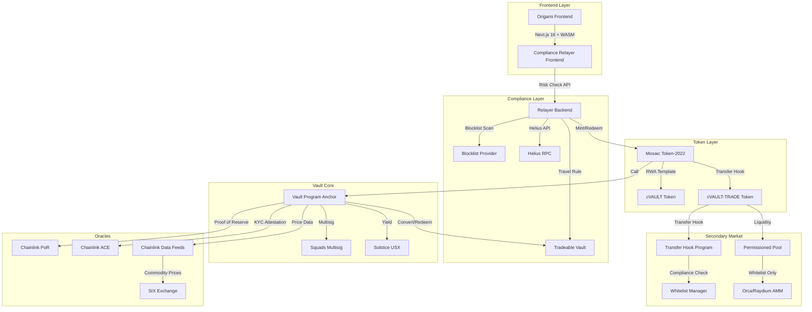

# Oragami (CommoVault) - Technical Specification

## StableHacks 2026 - Hackathon Details

**Event**: StableHacks - Building Institutional Stablecoin Infrastructure on Solana  
**Track**: RWA-Backed Stablecoin & Commodity Vaults (Track 4)  
**Deadline**: March 29, 2026 22:00  
**Demo Day**: May 28, 2026 in Zurich (Top 10 teams)

### Core Concept
A fully compliant, institutional-grade vault that lets regulated entities deposit assets → mint a backed vault token (cVAULT) → automatically allocate into Solstice USX for delta-neutral yield, while the underlying basket (Ondo-style tokenized Treasuries + SIX-priced commodities) is verified in real time by Chainlink Proof of Reserve + ACE.

**UPDATE: Added Secondary Market Tradeability**
Now includes cVAULT-TRADE token with permissioned secondary market via Solana Token-2022 Transfer Hooks, enabling compliant 24/7 trading between whitelisted institutions while maintaining all KYC/KYT/AML/Travel Rule requirements.

---

## Architecture Overview



---

## StableHacks Partners & Integrations

### Co-Hosts & Sponsors (Primary Partners)
| Partner | Integration | Priority |
|---------|-------------|----------|
| **Solana Foundation** | Token-2022 (Mosaic SDK) for RWA tokens | ✅ Required |
| **AMINA Bank** | Pilot opportunity, institutional compliance standards | ✅ Target |
| **Solstice** | USX yield integration, Solstream credits | ✅ Required |

### Ecosystem Partners (Secondary Integration)
| Partner | Purpose | Priority |
|---------|---------|----------|
| **SIX BFI** | Real commodity price data (Gold, Silver, Oil, FX) | ✅ Required |
| **Fireblocks** | Custody + policy engine simulation | 🔄 Post-hackathon |
| **Squads** | Multisig for vault administration | ✅ Required |
| **Chainlink ACE** | KYC/AML compliance attestation | ✅ Required |
| **Orca/Raydium** | Permissioned liquidity pool | 🔄 Post-hackathon |
| **Blueshift Doppler** | Developer toolkit + code examples | 📚 Reference |
| **Softstack** | Smart contract audit (1st place prize) | 🎯 Target |
| **UBS** | Potential pilot / institutional adoption | 🔄 Post-hackathon |
| **Keyrock** | Market making / liquidity | 🔄 Post-hackathon |
| **Steakhouse Financial** | DeFi strategy / yield optimization | 🔄 Post-hackathon |

---

## Token Design

### cVAULT Token
- **Purpose**: Vault share token (1:1 backed by RWA basket)
- **Type**: Token-2022 (Mosaic RWA template)
- **Extensions**:
  - Metadata (SIX commodity pricing display)
  - Permanent Delegate (vault can burn for redemption)
  - Pausable (emergency stop)
  - Default Account State (sRFC-37 allowlist - only compliant wallets)
- **Authority**: Squads multisig + vault PDA
- **Transferability**: Non-tradable by default (opt-in to cVAULT-TRADE for trading)

### cVAULT-TRADE Token
- **Purpose**: Tradeable vault share token for secondary markets
- **Type**: Token-2022 with Transfer Hook extension
- **Extensions**:
  - Transfer Hook → triggers compliance check on every transfer
  - Metadata (backed by cVAULT underlying)
  - Permanent Delegate (for redemption)
- **Authority**: Vault program PDA + Squads multisig
- **Transferability**: Fully tradeable on permissioned DEX pools but only between whitelisted, compliant wallets

### Underlying Basket (SIX-Priced)
- Tokenized Treasuries (Ondo-style)
- Commodities priced via SIX Exchange API (Gold, Silver, Oil, etc.)

---

## Secondary Market Tradeability

### Overview
The secondary market feature adds tradeability to vault tokens while maintaining full compliance:

1. **Issue two tokens from the vault**:
   - **cVAULT** - Main vault share token (non-tradable by default)
   - **cVAULT-TRADE** - Fractional/transferable version (tradeable on secondary markets)

2. **Enable compliant trading**:
   - Only whitelisted, compliant wallets can trade
   - Transfer Hook enforces KYC/KYT/AML/Travel Rule on every transfer
   - Permissioned DEX pool limits liquidity to compliant participants

### Token Conversion Flow
```
1. Institution deposits → mints cVAULT (vault share, non-tradable)
2. Opt-in to secondary trading → converts cVAULT → cVAULT-TRADE (1:1)
3. Trades cVAULT-TRADE on permissioned pool with another compliant institution
4. Redemption: burn cVAULT-TRADE → get underlying RWAs/USX (1:1)
```

### Compliance Enforcement

**Transfer Hook Implementation**:
```rust
// Every cVAULT-TRADE transfer triggers this program
pub fn execute_transfer_hook(ctx: Context<TransferHook>, params: TransferHookParams) -> Result<()> {
    // 1. Check transfers are enabled
    require!(ctx.accounts.config.allow_transfers, TransferHookError::TransferDisabled);
    
    // 2. Verify source wallet compliance (KYC/AML/Travel Rule)
    validate_compliance(ctx.accounts.source.owner)?;
    
    // 3. Verify destination wallet compliance
    validate_compliance(ctx.accounts.destination.owner)?;
    
    // 4. Log and allow transfer
    msg!("Transfer compliance check passed");
    Ok(())
}
```

**Whitelist Management**:
- Admins can add/remove wallets from the whitelist
- Each entry tracks: KYC status, AML status, Travel Rule compliance, expiry
- Integration with Chainlink ACE for production oracle attestation

### Permissioned DEX Pool

**Pool Features**:
- Constant product AMM (simplified for demo)
- Only whitelisted wallets can add liquidity or trade
- 0.3% fee (30 bps)
- LP tokens represent share of pool reserves

**Pool Operations**:
1. **Add Liquidity**: Only whitelisted users can provide liquidity
2. **Remove Liquidity**: Only whitelisted users can withdraw
3. **Swap**: Only whitelisted users can trade cVAULT-TRADE for USDC/etc.

---

## Compliance Flow

Every operation follows this exact sequence:

1. **User connects wallet** in frontend
2. **Risk Check API** → backend runs:
   - Blocklist scan
   - Range Protocol check
   - Helius address analysis
3. **WASM Signing** → User signs `{from}:{to}:{amount}:{mint}:{nonce}` client-side
4. **ACE Attestation** → Mock oracle returns KYC/KYT/AML/Travel Rule compliance
5. **Vault Operation** → Only then does the vault program mint/redeem/trade

### Secondary Market Compliance
For cVAULT-TRADE transfers:
1. **Pre-Transfer Check**: Source and destination must be whitelisted
2. **Transfer Hook**: On-chain program validates compliance automatically
3. **Whitelist Update**: Admins manage allowed wallets via compliance service

---

## Core Flows

### 1. Deposit & Mint
```
User deposits USDC/SOL
    → Compliance Check (risk-scan + WASM sign + ACE)
    → Mosaic issues cVAULT (Token-2022)
    → Vault swaps portion → Solstice USX
    → Chainlink PoR updates
```

### 2. Yield Accrual
```
Auto-call Solstice YieldVault
    → Claim USX yield
    → Reinvest or distribute
```

### 3. Redeem
```
User submits redemption request
    → Compliance Check
    → Burn cVAULT (permanent delegate)
    → Return USX + pro-rata RWA basket
    → Prices from Chainlink + SIX Exchange
```

### 4. Convert to Tradeable (New)
```
User wants to trade cVAULT on secondary market
    → Compliance Check (already done if holding cVAULT)
    → Call convert_to_tradeable on vault program
    → Burn cVAULT → Mint cVAULT-TRADE (1:1)
    → Now tradable on permissioned pool
```

### 5. Trade on Secondary Market (New)
```
User A wants to sell cVAULT-TRADE to User B
    → Both users must be whitelisted
    → Transfer Hook validates compliance
    → Transfer executes on-chain
    → User B now holds cVAULT-TRADE
```

### 6. Redeem Tradeable (New)
```
User wants to exit position
    → Burn cVAULT-TRADE
    → Choose: receive cVAULT OR underlying RWAs
    → Redemption executes
```

---

## Implementation Details

### New Program: cvault-transfer-hook
- **Purpose**: Enforce compliance on every cVAULT-TRADE transfer
- **Features**:
  - Whitelist management (add/remove wallets)
  - Compliance config (enable/disable transfers, set KYC requirements)
  - Transfer hook entry point (called by Token-2022 on every transfer)
- **Program ID**: `Cvau1tT3xGK9XQDqVjG1qGjvMaVQDqVjG1qGjvMaVQD`

### Updated Vault Program
- Added `cvault_trade_mint` field to VaultState
- Added `secondary_market_enabled` flag
- Added `convert_to_tradeable` instruction
- Added `redeem_tradeable` instruction
- Added new error codes for secondary market

### Frontend Services
- `cvault-trade.ts` - Token conversion and redemption APIs
- `transfer-hook-client.ts` - Whitelist management client
- `permissioned-pool.ts` - DEX pool operations

---

## Reference Repositories

| Repo | Purpose | Integration |
|------|---------|-------------|
| [solana-foundation/mosaic](https://github.com/solana-foundation/mosaic) | Token-2022 issuance (RWA template + sRFC-37) | **Clone** into `/frontend/mosaic` |
| [Berektassuly/solana-compliance-relayer-frontend](https://github.com/Berektassuly/solana-compliance-relayer-frontend) | Compliance UI + WASM signer + relayer backend | **Clone** into `/backend/compliance-relayer` and `/frontend/relayer-frontend` |

---

## SIX Data Integration

- **Real SIX API**: User has provided actual SIX data API credentials
- No mock needed - integrate directly for commodity pricing
- Fallback: Local cache if API unavailable

---

## Compliant Flow on Solana

### How Compliance Works on Solana

The compliance flow on Solana follows a multi-layer approach:

1. **Client-Side (Frontend)**:
   - User initiates transaction in frontend
   - WASM signer prepares the transaction payload
   - Message format: `{from}:{to}:{amount}:{mint}:{nonce}`
   - Keys never leave the browser - all signing is client-side

2. **Pre-Transaction Compliance Check (API Layer)**:
   - Before submitting to chain, call compliance API endpoint
   - Backend performs:
     - Blocklist scan ( database check)
     - Risk scoring (Helius RPC for address analysis)
     - Travel Rule metadata validation
     - Chainlink ACE attestation check
   - If compliant → return signed payload + approval token
   - If non-compliant → reject with reason

3. **On-Chain Enforcement (Token-2022)**:
   - Token extensions enforce compliance at protocol level:
     - **sRFC-37 Access Control**: Allowlist/Blocklist at token level
     - **Transfer Hook**: Triggers compliance program on every transfer
     - **Permanent Delegate**: Vault can burn tokens for redemption
   - These run automatically on-chain

4. **Post-Transaction (Monitoring)**:
   - All transactions logged for audit
   - Real-time dashboard shows compliance status
   - Admin can update blocklists/allowlists

### Architecture Decision: API-Centric Compliance

```
User Action → Frontend → Compliance API → [Blocklist|Risk|ACE] → Approve/Reject
                                           ↓
                                    On-Chain (Token-2022 extensions enforce)
```

**Why API call is needed**: The compliance check happens BEFORE the transaction hits the blockchain. This is critical because:
- Saves gas on rejected transactions
- Provides better UX with clear rejection reasons

---

## Why This Wins the Hackathon

### Innovation
- **First fully tradeable institutional commodity vault on Solana**
- Combines Ondo's RWA model + Solstice USX yield + Chainlink compliance + native secondary market liquidity

### Institutional Fit
- Transfer Hooks + ACE = on-chain enforcement of every required rule
- Fireblocks/SIX/Solstice partners will notice the institutional-grade compliance
- Whitelisted trading keeps regulators happy while enabling liquidity

### Scalability
- Solves the exact liquidity problem Ondo and Solstice face
- Permissioned pools prevent the USX-style liquidity drain
- Post-hackathon: Integrate Ondo Global Markets liquidity layer

### Execution
- MVP fits in remaining hackathon time
- Uses existing Mosaic SDK + Compliance Relayer components
- Simple constant product pool for demo (can upgrade to Orca/Raydium post-hackathon)

---

## Quick Start (Demo)

1. **Initialize Vault**:
   ```bash
   anchor run deploy
   ```

2. **Enable Secondary Market**:
   ```bash
   anchor run update-config --secondary-market-enabled true
   ```

3. **Create cVAULT-TRADE Token**:
   - Use Mosaic SDK with Transfer Hook extension
   - Set transfer hook program to cvault-transfer-hook

4. **Add to Whitelist**:
   ```typescript
   import { addToWhitelist } from './transfer-hook-client';
   await addToWhitelist(connection, payer, { walletAddress, kycCompliant: true, ... });
   ```

5. **Trade**:
   - Only whitelisted wallets can add liquidity or swap
   - Every transfer triggers compliance hook

---

*Last Updated: March 25, 2026*
*Version: 1.1 (Added Secondary Market Tradeability)*